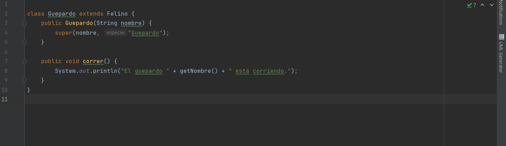

# Felinos

INSTRUCCIONES
Con la temática felinos

Diseñar un diagrama UML para las diferentes especies que pueda consultar.

Implementar una aplicación que permita ingresar felinos de al menos 5 especies.

DESARROLLO

Clase Felino:
Esta clase es la clase base que representa a todos los felinos, que tiene dos atributos privados: nombre y especie.

Subclases de la clase Felino:

Clase Main:
Permimte la ejecucion del programa utilizando el método mostrarInformacion() de cada felino.

Funcionamiento del sistem

Diagrama UML

